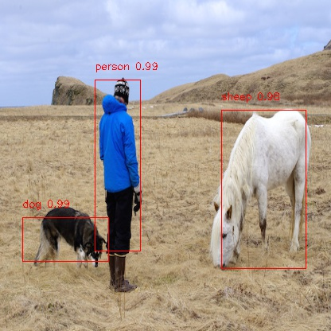

# yolo\_tensorflow\_practice

todo:

  - [ ], metrics
  - [ ], MobileNet / darknet53
  - [ ], Test image of variable size
  - [x], Data
  - [x], ResNet / darknet19
  - [x], lLoss func
  - [x], NMS

示例：  
  
(voc2007 all + 80k iters)